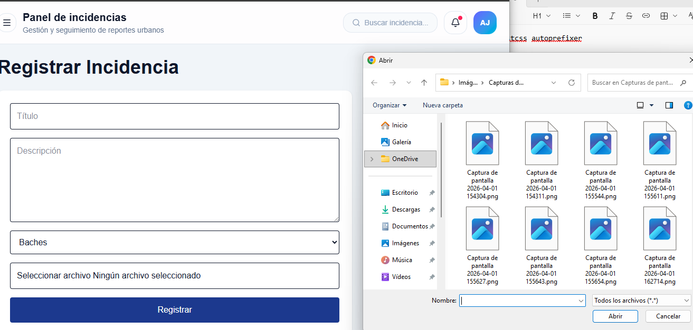
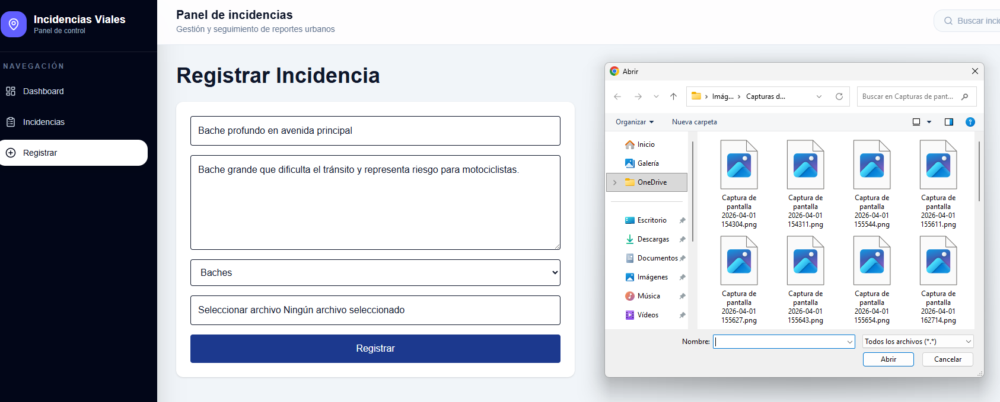
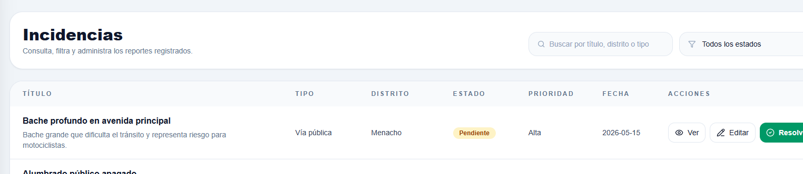
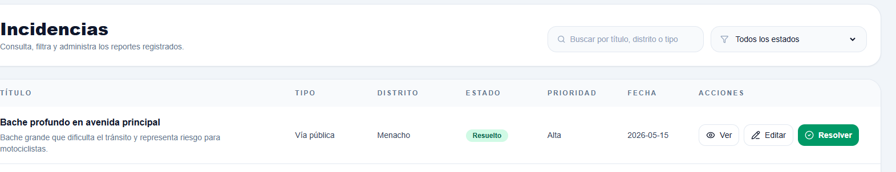

# CASOS DE PRUEBA
# Sistema de Gestión de Incidencias Urbanas

---

# Información del documento

| Campo | Descripción |
|---|---|
| Proyecto | Sistema de Gestión de Incidencias |
| Versión | 1.0 |
| Documento | Casos de prueba |
| Frontend | React + TypeScript |
| Backend | Node.js + Fastify |
| Base de datos | PostgreSQL |
| Fecha | 2026 |

---

# Objetivo

El objetivo de este documento es validar el correcto funcionamiento de las funcionalidades implementadas en el sistema de gestión de incidencias urbanas, garantizando estabilidad, integridad de datos y una correcta experiencia de usuario.

---

# Entorno de pruebas

| Elemento | Valor |
|---|---|
| Sistema operativo | Windows 10 / 11 |
| Navegador | Google Chrome |
| Frontend | Vite + React |
| Backend | Fastify |
| Puerto frontend | 5173 |
| Puerto backend | 3000 |

---

# CP-01 Registro de incidencia

## Descripción
Verificar que el sistema permita registrar correctamente una incidencia urbana.

## Precondiciones
- Sistema iniciado correctamente.
- Backend disponible.
- Formulario accesible.

## Datos de entrada

| Campo | Valor |
|---|---|
| Título | Bache en avenida principal |
| Tipo | Vía pública |
| Prioridad | Alta |
| Distrito | Menacho |
| Descripción | Bache profundo que dificulta el tránsito vehicular. |

## Pasos

1. Ingresar al módulo "Registrar".
2. Completar todos los campos.
3. Adjuntar imagen.
4. Presionar "Guardar incidencia".

## Resultado esperado

- El sistema registra la incidencia.
- Se muestra mensaje de éxito.
- La incidencia aparece en el dashboard.
- Se actualizan las métricas.

## Estado
Pendiente.

---

# CP-02 Validación de campos obligatorios

## Descripción
Verificar que el sistema valide campos vacíos.

## Pasos

1. Abrir formulario.
2. Dejar campos vacíos.
3. Presionar botón guardar.

## Resultado esperado

- El sistema impide el registro.
- Se muestran mensajes de validación.

## Estado
Pendiente.

---

# CP-03 Consulta de incidencias

## Descripción
Validar visualización de incidencias registradas.

## Pasos

1. Acceder al módulo "Incidencias".
2. Revisar listado.

## Resultado esperado

- Se muestran incidencias correctamente.
- La tabla contiene información válida.

## Estado
Pendiente.

---

# CP-04 Filtrado por estado

## Descripción
Validar filtro de incidencias.

## Pasos

1. Acceder al listado.
2. Seleccionar estado "Pendiente".

## Resultado esperado

- Solo aparecen incidencias pendientes.

## Estado
Pendiente.

---

# CP-05 Cambio de estado

## Descripción
Validar actualización de estado.

## Pasos

1. Seleccionar incidencia.
2. Presionar botón "Resolver".

## Resultado esperado

- El estado cambia a "Resuelto".
- Dashboard actualiza estadísticas.

## Estado
Pendiente.

---

# CP-06 Responsive Design

## Descripción
Validar comportamiento responsive.

## Pasos

1. Reducir tamaño del navegador.
2. Abrir sistema desde móvil.

## Resultado esperado

- El diseño se adapta correctamente.
- No existen desbordamientos.

## Estado
Pendiente.

---

# CP-07 Rendimiento del dashboard

## Descripción
Validar tiempo de carga.

## Pasos

1. Abrir dashboard.
2. Medir tiempo de carga.

## Resultado esperado

- Dashboard carga en menos de 3 segundos.

## Estado
Pendiente.

---

# CP-08 Subida de imágenes

## Descripción
Validar carga de archivos multimedia.

## Pasos

1. Abrir formulario.
2. Adjuntar imagen válida.
3. Registrar incidencia.

## Resultado esperado

- Archivo subido correctamente.
- Sistema acepta formatos válidos.

## Estado
Pendiente.

---

# CP-09 Integración frontend-backend

## Descripción
Validar comunicación API REST.

## Pasos

1. Registrar incidencia.
2. Revisar respuesta backend.

## Resultado esperado

- Backend responde correctamente.
- Datos enviados correctamente.

## Estado
Pendiente.

---

# CP-10 Persistencia de datos

## Descripción
Validar almacenamiento de datos.

## Pasos

1. Registrar incidencia.
2. Reiniciar aplicación.
3. Consultar listado.

## Resultado esperado

- Los datos permanecen almacenados.

## Estado
Pendiente.

---

# Evidencias recomendadas

## Capturas sugeridas

---

# Conclusiones

Las pruebas realizadas permitirán validar el correcto funcionamiento del sistema tanto a nivel funcional como visual. Asimismo, garantizarán la correcta interacción entre frontend, backend y base de datos antes de la entrega final del proyecto.

