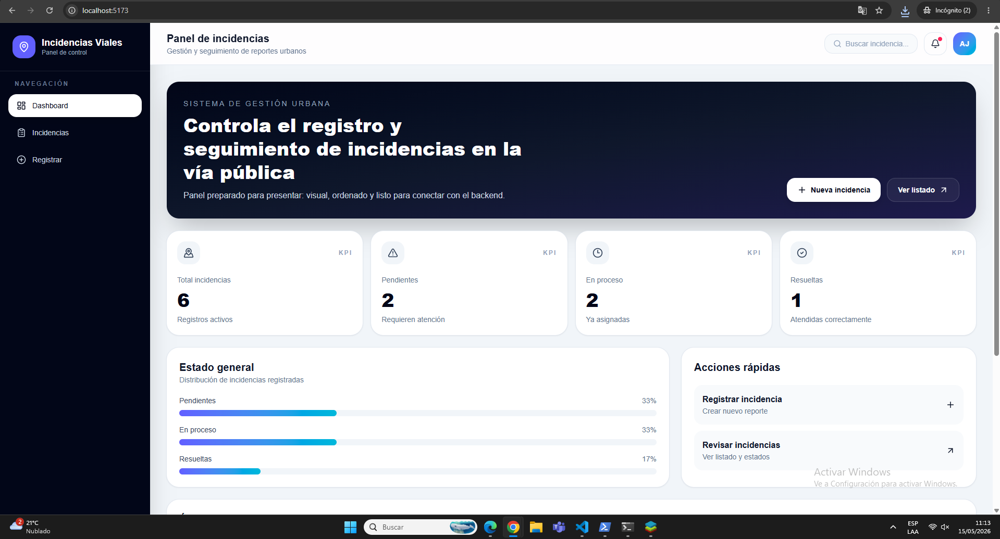
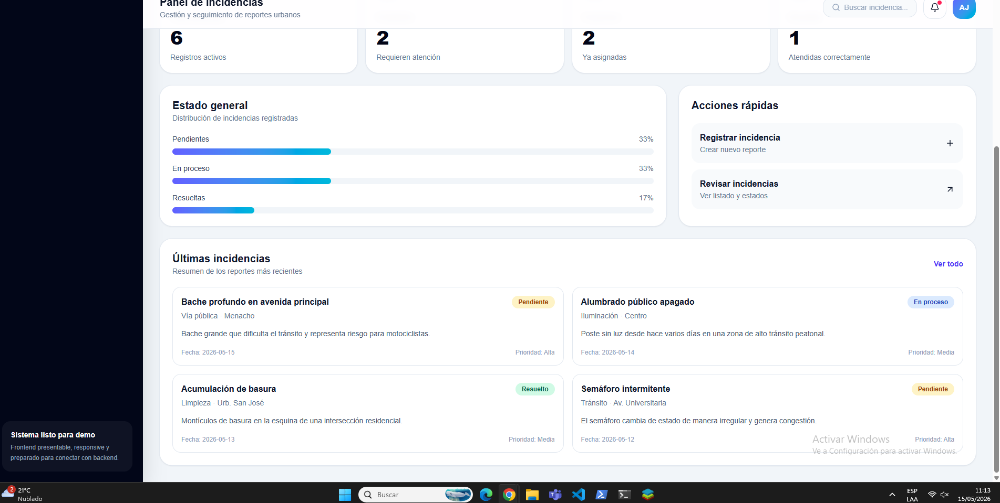
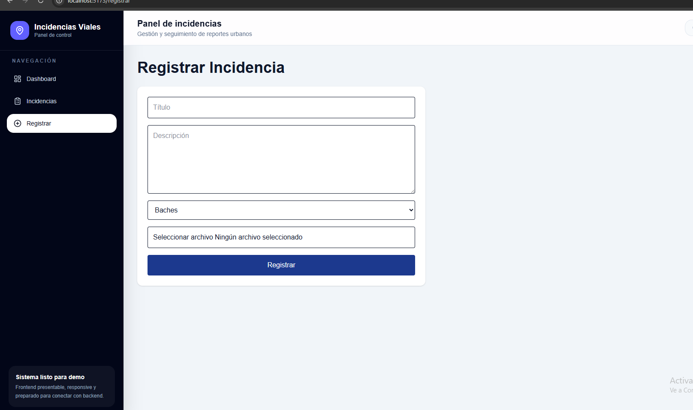
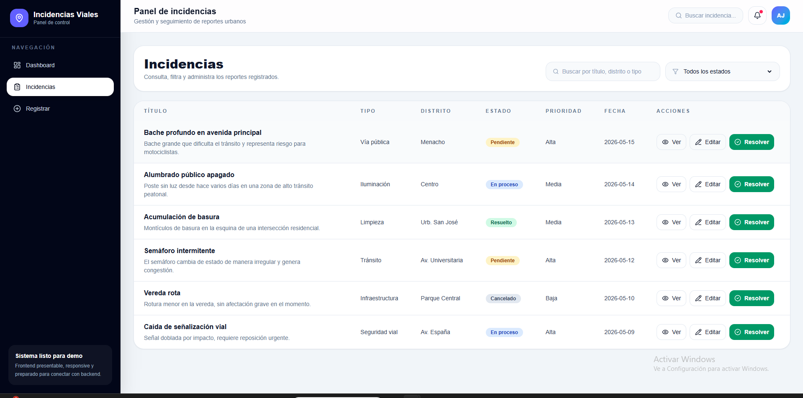

# CASOS DE PRUEBA
# Sistema de Gestión de Incidencias Urbanas

---

# Información general

| Campo | Valor |
|---|---|
| Proyecto | Sistema de Gestión de Incidencias |
| Versión | 1.0 |
| Tipo de pruebas | Funcionales |
| Frontend | React + TypeScript |
| Backend | Node.js + Fastify |
| Base de datos | PostgreSQL |
| Fecha | 2026 |

---

# Objetivo

Validar el correcto funcionamiento de las funcionalidades principales del sistema de gestión de incidencias urbanas, garantizando estabilidad, integridad de datos y correcta interacción entre frontend y backend.

---

# Entorno de pruebas

| Elemento | Descripción |
|---|---|
| Sistema Operativo | Windows 10/11 |
| Navegador | Google Chrome |
| Frontend | Vite + React |
| Backend | Fastify |
| Puerto frontend | 5173 |
| Puerto backend | 3000 |

---

# CP-01 Registro exitoso de incidencia

## Objetivo
Verificar que el sistema permita registrar correctamente una incidencia.

## Precondiciones
- El sistema debe estar ejecutándose.
- El formulario debe estar accesible.

## Datos de entrada

| Campo | Valor |
|---|---|
| Título | Bache en avenida principal |
| Tipo | Vía pública |
| Prioridad | Alta |
| Distrito | Menacho |
| Descripción | Existe un bache profundo que dificulta el tránsito. |

## Pasos

1. Ingresar al módulo "Registrar".
2. Completar todos los campos obligatorios.
4. Presionar el botón "Guardar incidencia".

## Resultado esperado

- El sistema registra la incidencia.
- Se muestra mensaje de éxito.
- La incidencia aparece en el listado.
- El dashboard actualiza métricas.

## Resultado obtenido

Pendiente.

## Estado

Pendiente.

---

# CP-02 Validación de campos obligatorios

## Objetivo
Verificar que el sistema valide campos vacíos.

## Precondiciones
Formulario activo.

## Pasos

1. Ingresar al formulario.
2. Dejar campos vacíos.
3. Presionar "Guardar incidencia".

## Resultado esperado

- El sistema bloquea el envío.
- Se muestran mensajes de validación.
- No se registra información vacía.

## Estado

Pendiente.

---

# CP-03 Consulta de incidencias

## Objetivo
Validar la visualización del listado de incidencias.

## Pasos

1. Acceder al módulo "Incidencias".
2. Revisar tabla de incidencias.

## Resultado esperado

- Se muestran incidencias registradas.
- La tabla presenta información correcta.
- Se visualizan estados y prioridades.

## Estado

Pendiente.

---

# CP-04 Filtrado por estado

## Objetivo
Validar el filtro de incidencias.

## Pasos

1. Acceder al listado.
2. Seleccionar filtro "Pendiente".

## Resultado esperado

- Solo aparecen incidencias pendientes.

## Estado

Pendiente.

---

# CP-05 Cambio de estado

## Objetivo
Verificar actualización de estado.

## Pasos

1. Seleccionar incidencia.
2. Presionar "Resolver".

## Resultado esperado

- El estado cambia a "Resuelto".
- Dashboard actualiza métricas.

## Estado

Pendiente.

---

# CP-06 Responsive Design

## Objetivo
Validar diseño responsive.

## Pasos

1. Reducir tamaño de pantalla.
2. Abrir sistema en móvil.

## Resultado esperado

- Sidebar responsive.
- Componentes alineados.
- Sin desbordamientos visuales.

## Estado

Pendiente.

---

# CP-07 Rendimiento del dashboard

## Objetivo
Validar carga rápida del dashboard.

## Pasos

1. Iniciar aplicación.
2. Abrir dashboard.

## Resultado esperado

- Dashboard carga en menos de 3 segundos.
- KPIs visibles correctamente.

## Estado

Pendiente.

---

# CP-08 Validación de subida de imágenes

## Objetivo
Validar carga de archivos.

## Pasos

1. Abrir formulario.
3. Registrar incidencia.

## Resultado esperado

- Imagen subida correctamente.
- Sistema acepta formatos válidos.

## Estado

Pendiente.

---

# CP-09 Integración frontend-backend

## Objetivo
Validar conexión API REST.

## Pasos

1. Registrar incidencia.
2. Revisar backend.
3. Consultar endpoint.

## Resultado esperado

- Frontend envía datos correctamente.
- Backend responde con código 200/201.
- Datos persistidos correctamente.

## Estado

Pendiente.

---

# CP-10 Integridad de datos

## Objetivo
Validar persistencia de datos.

## Pasos

1. Registrar incidencia.
2. Reiniciar frontend.
3. Consultar listado.

## Resultado esperado

- Datos permanecen almacenados.
- No existe corrupción de datos.

## Estado

Pendiente.

---

# Conclusiones

Las pruebas permitirán validar el correcto comportamiento del sistema tanto a nivel visual como funcional. Asimismo, garantizarán la correcta interacción entre frontend, backend y base de datos antes de la entrega final del proyecto.

